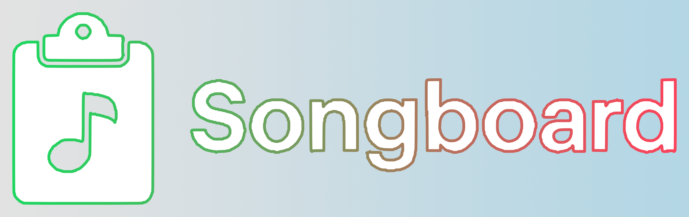

# Songboard · Song.link Clipboard Watcher for macOS

  

Songboard keeps every music link you copy ready for everyone. Grab a track from Spotify or Apple Music and your clipboard refreshes with a universal [Song.link](https://song.link) share—perfect for texts, socials, and anywhere your listeners are.

> Crafted for curators, artists, and friends who want sharing to feel native on macOS.



---

## ✨ Designed for the way you share
- macOS-first experience that runs quietly in the background and relaunches at login
- Instant Song.link conversion for Spotify, Apple Music, YouTube (Music), Tidal, Amazon Music, Deezer, SoundCloud, Bandcamp, and more
- Clipboard protection that avoids loops and keeps your original copy safe if anything fails
- Lightweight, dependency-free Python script you can read in a single glance

---

## 🚀 Set up in minutes

> Requires macOS with Python 3 (preinstalled on current macOS versions).

- Prefer a packaged download? Grab the Gumroad bundle: [Songboard on Gumroad](https://willsigmon.gumroad.com/l/songboard). It ships with the script and step-by-step install guide.
- Want a direct zip? Always up-to-date download: [songboard-macos.zip](https://github.com/willsigmon/songboard/releases/download/bundle/songboard-macos.zip).

```bash
# 1. Drop the watcher script on your machine
mkdir -p ~/Scripts
curl -o ~/Scripts/songlink_clipboard_watcher.py https://raw.githubusercontent.com/willsigmon/songboard/main/songlink_clipboard_watcher.py
chmod +x ~/Scripts/songlink_clipboard_watcher.py

# 2. Install a LaunchAgent so it auto-starts on login
mkdir -p ~/Library/LaunchAgents
cat > ~/Library/LaunchAgents/com.songlink.clipboard.plist <<'EOF'
<?xml version="1.0" encoding="UTF-8"?>
<!DOCTYPE plist PUBLIC "-//Apple//DTD PLIST 1.0//EN" "http://www.apple.com/DTDs/PropertyList-1.0.dtd">
<plist version="1.0">
<dict>
    <key>Label</key>
    <string>com.songlink.clipboard</string>
    <key>ProgramArguments</key>
    <array>
        <string>/usr/bin/python3</string>
        <string>/Users/$USER/Scripts/songlink_clipboard_watcher.py</string>
    </array>
    <key>RunAtLoad</key>
    <true/>
    <key>StandardErrorPath</key>
    <string>/tmp/songlink.err</string>
    <key>StandardOutPath</key>
    <string>/tmp/songlink.out</string>
</dict>
</plist>
EOF

# 3. Fire it up
launchctl load ~/Library/LaunchAgents/com.songlink.clipboard.plist
```

Copy any Spotify or Apple Music track URL. Your clipboard immediately holds `https://song.link/...` ready to share everywhere.

---

## 🧠 macOS tips
- On first launch, macOS may prompt you to allow `/usr/bin/python3` (Songboard) under **System Settings → Privacy & Security → Accessibility**. Approve it to enable instant Command+C triggers; decline and Songboard simply falls back to gentle polling.
- Pause Songboard dynamically with `launchctl unload ~/Library/LaunchAgents/com.songlink.clipboard.plist`; reload when you want it back.
- Extend coverage by adding hosts to `SONG_HOSTS`, `SONG_HOST_PREFIXES`, or `SONG_HOST_SUFFIXES` inside `songlink_clipboard_watcher.py`.
- Need insight? Tail `/tmp/songlink.err` while you iterate.

---

## 💡 Behind the scenes
- Polls the clipboard every 200 ms using `pbpaste`/`pbcopy`
- Guards against double-processing so you don’t lose the original link
- Retries gracefully if macOS rejects a clipboard write
- Lives in [`songlink_clipboard_watcher.py`](songlink_clipboard_watcher.py) (≈120 lines)

Peek at the full walkthrough in [`songlink-setup.md`](songlink-setup.md) for extra installation context and uninstall instructions.

---

## 📸 Share-ready assets
- Upload `docs/social-preview.png` as the GitHub social preview (Settings → General → Social preview) and bring the same image to your social launch.
- Suggested caption: *Songboard instantly turns every music link I copy into a universal Song.link page. One copy, every streaming service. https://github.com/willsigmon/songboard*
- Demonstration clips or GIFs live well inside `docs/`—link them from the README or your announcement post.
- Planning a Gumroad launch? Follow [`docs/gumroad-setup.md`](docs/gumroad-setup.md) for the exact steps and assets.

---

## ❤️ Tip jar
Like Songboard? Fuel the caffeine.

- [PayPal](https://www.paypal.com/paypalme/wsig)
- [Venmo](https://account.venmo.com/u/willsigmon)
- [Cash App](https://cash.app/$WSig)

---

## 🗺️ Roadmap ideas
- Optional menu bar indicator
- Global keyboard shortcut to toggle the watcher
- Support for YouTube Music, Tidal, and Amazon Music

Open an issue or submit a PR if you want to help push these forward.

---

## 📝 License

Released under the [MIT License](LICENSE). Have fun, share broadly, and let us know where you drop your first universal link!
